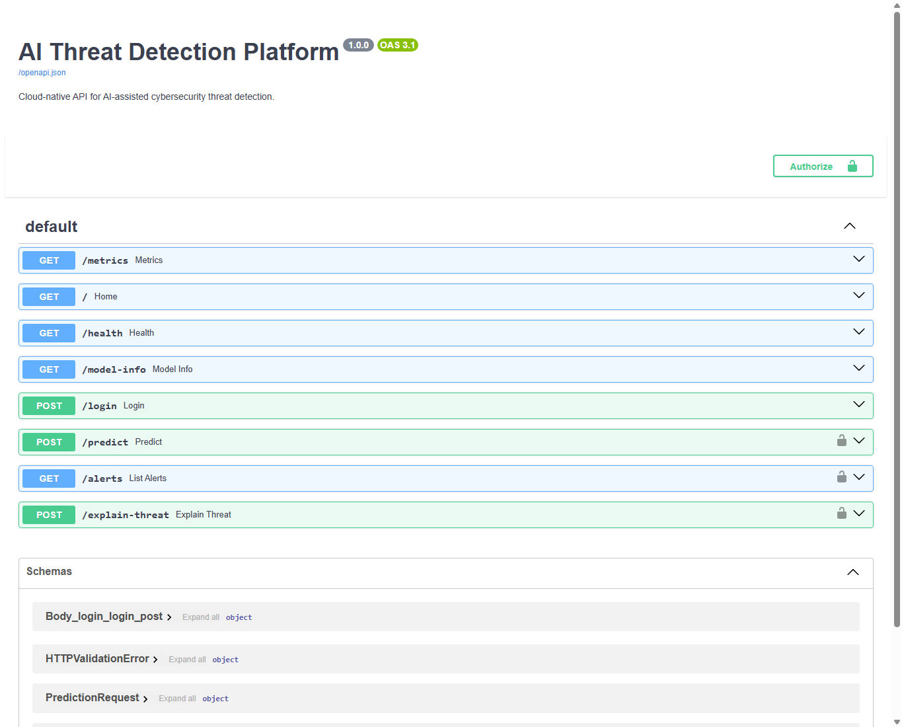
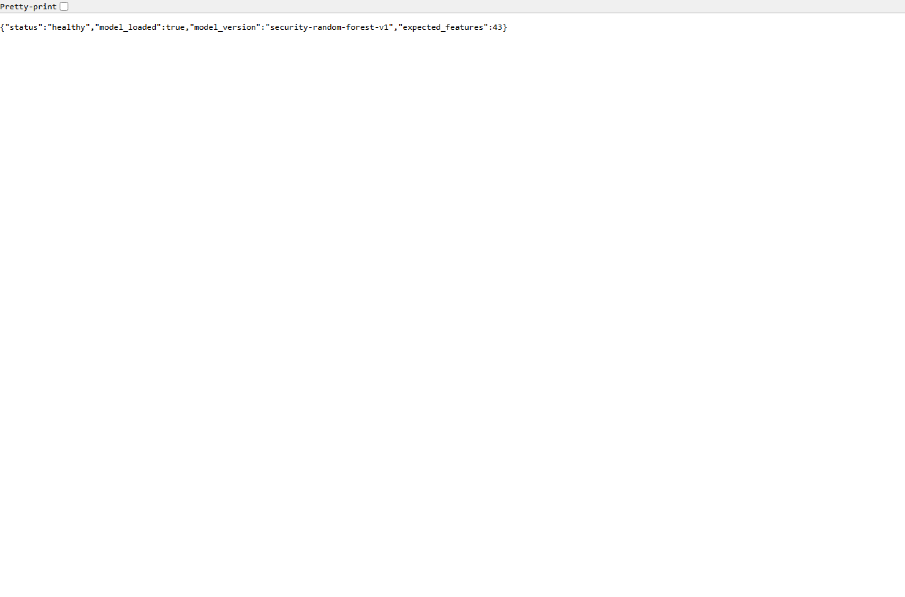
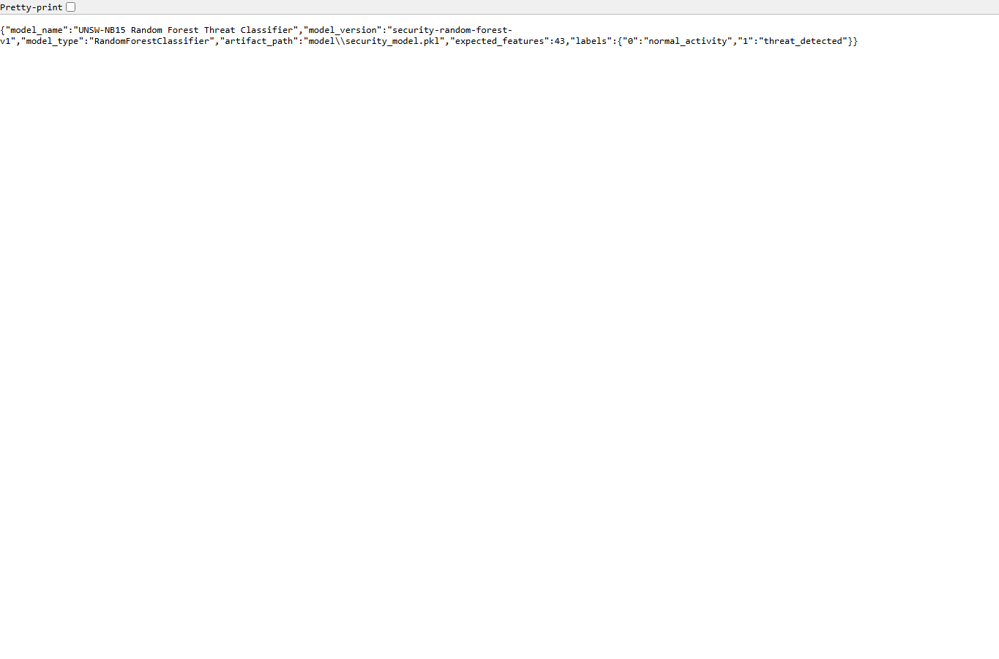
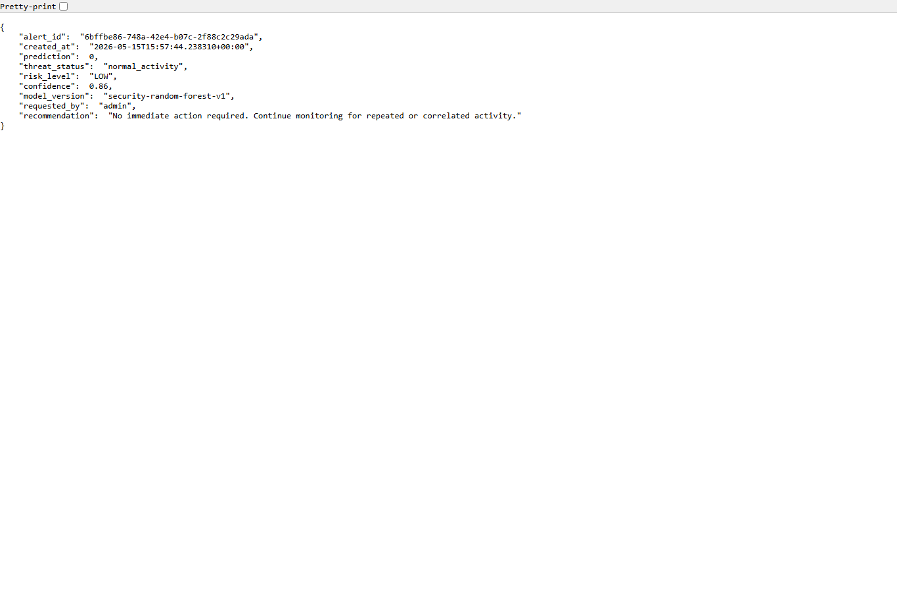

# Platform Demo

This walkthrough shows the AI Threat Detection Platform running locally through FastAPI and Swagger UI.

## 1. Start The API

```powershell
uvicorn app.main:app --reload
```

Open Swagger UI:

```text
http://127.0.0.1:8000/docs
```

## 2. Swagger UI

The Swagger page shows the available endpoints for health checks, model metadata, login, predictions, alerts, explanations, and Prometheus metrics.



## 3. Health Check

The `/health` endpoint confirms the API is running and the model is loaded.



## 4. Model Metadata

The `/model-info` endpoint shows the model type, model version, artifact path, expected feature count, and prediction labels.



## 5. Prediction Response

After logging in and sending `sample_prediction_request.json` to `/predict`, the API returns a security-focused response with an alert ID, risk level, confidence score, model version, and recommendation.



The captured JSON response is also saved here:

```text
docs/assets/prediction-response.json
```

## Demo Credentials

```text
username: admin
password: password123
```

## What This Demo Proves

- The FastAPI app starts successfully
- The model artifact loads correctly
- API documentation is available through Swagger
- Authenticated prediction works
- The platform generates analyst-friendly output
- Monitoring endpoints are exposed for Prometheus
